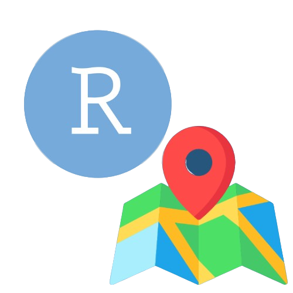

# ___Novedades___

<body>
  

  

    
### ¡Descubre el poder de los mapas: Aprende a crear y manipular datos económicos con QGIS!

### ¡Emociónate con este curso! Añadi la planeación del curso para aprender a crear mapas con QGIS, donde manipularás datos económicos y los montarás en un sistema SIG para su uso geográfico. Descubre el poder de los mapas y toma decisiones informadas. ¡Da clic en la imagen!

  

  

  

  

  

### ¡Explora y descubre lugares increíbles! Esta guía paso a paso te muestra dos métodos para encontrar puntos de interés (datos vectoriales) con Google Maps y R Studio. Desde museos y restaurantes hasta parques y hoteles, desbloquea un mundo de posibilidades con estas herramientas poderosas. 🗺️📍

   

  

  
</body>